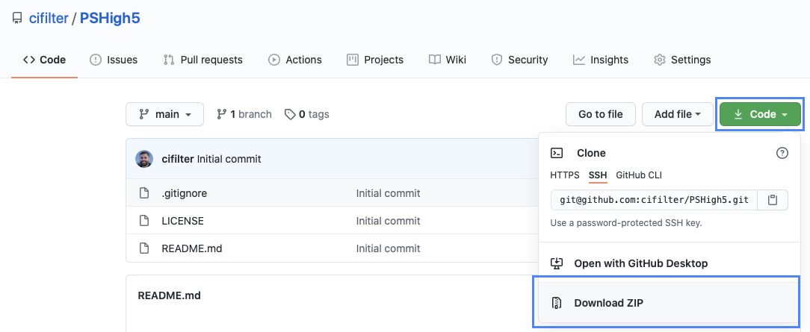
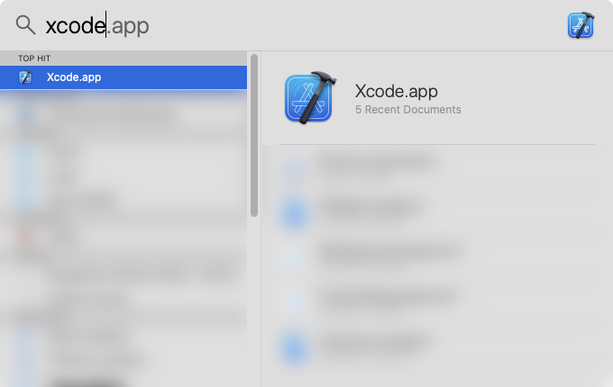
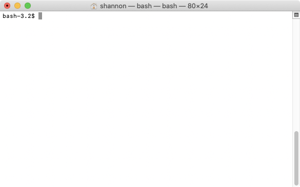
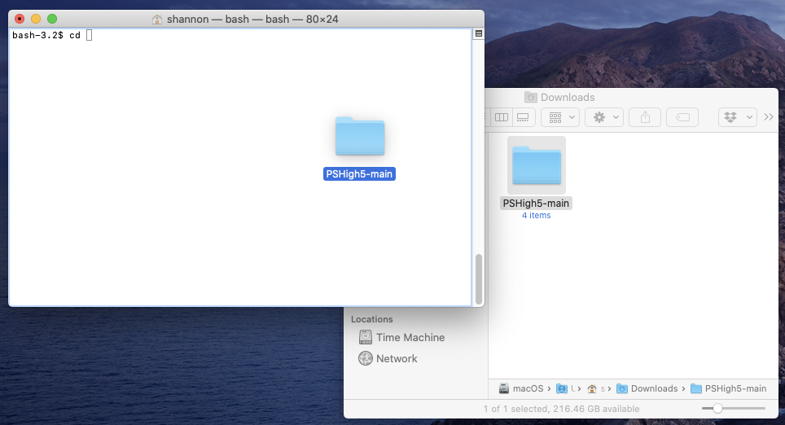

# 🙏 PSHigh5

`PSHigh5` is a macOS Swift 5 script that continuously checks for PlayStation 5 stock 
on Sony's website and alerts the user with sound and a bouncing `Terminal.app` Dock icon
when either the store queue or product stock is detected.

```
╰─ swift sh PSHigh5.swift

[3/3] Linking PSHigh5
[LOG] 4:52:54 PM EST: Began loading product page.
[LOG] 4:52:55 PM EST: Finished loading product page.
[LOG] 4:52:55 PM EST: PS5 is sold out. 😡 Trying again...
[LOG] 4:53:01 PM EST: Began loading product page.
[LOG] 4:52:02 PM EST: Finished loading product page.
[LOG] 4:52:02 PM EST: PS5 is sold out. 😡 Trying again...
...
[LOG] 5:51:32 PM EST: PS5 is in stock! 🥳🙏
```

Often, relying on external services to notify you of PlayStation 5 stock has a non-
trivial delay associated with it, which basically results in no chance of getting a
(pre-)order. Running `PSHigh5` locally on your system ensures that you'll know the
instant PlayStation Direct has been updated so you can try to get in the queue (or
add a PS5 to your cart).

## Requirements

1. **macOS**: `PSHigh5` is a macOS-only script as it relies on AppKit to create a
browser it can read. While Swift itself is available for multiple platforms, AppKit
is only available on macOS.

1. **Xcode**: Executing Swift scripts requires the `swift` shell command, which is
available after [installing Xcode](https://apps.apple.com/us/app/xcode/id497799835?mt=12).

1. **Homebrew**: `swift-sh`, which packages Swift shell script dependencies and
creates an ad-hoc execution package, is [installed using Homebrew](https://brew.sh).

1. **`swift-sh`**: `brew install swift-sh`

1. **Be near your computer**: Obviously, you must be at or near your computer while this
script is running, as it does not (yet?) offer any remote notification capability to
otherwise inform you that it detects a store queue or product stock.

## Usage

### For Tech-Savvy Users

1. Ensure you're running on a recent version of macOS, have Xcode installed, have Homebrew
installed, and have the `swift-sh` brew installed.

1. Run the script:

    ```bash
     swift sh PSHigh5.swift
    ```

    > ⚠️ If you decide to copy or move `PSHigh5.swift` to some other directory before
    > executing it, you must also copy the `.sounds` folder along with it, or none of
    > the alert sounds will play. The scripts expects `.sounds` to exist at the same
    > root as `PSHigh5.swift`.

1. If `Terminal.app` bounces and shows a badge, you need to complete a CAPTCHA
challenge.

1. If you hear an [alert fanfare](https://www.youtube.com/watch?v=bk3GMKplQlg)
(YouTube), then that means the script was able to determine that PlayStation Direct page
is showing the entry queue. Load the product page in your browser and complete the
CAPTCHA challenge to enter the queue!

1. If you hear a [victory fanfare](https://www.youtube.com/watch?v=JzRD4pDRE-8)
(YouTube), then that means the script was able to determine that the **"Add to
Cart"** button is visible on the PlayStation 5 product page.

### For Not-So-Tech-Savvy Users

#### First-Time Steps

These steps only need to be performed one time. After that, you just need to follow the
**"Running the Script"** steps below whenever you want to use it.

1. **Download `PSHigh5`**

    At the top of this GitHub repository ([`cifilter/PSHigh5`](https://github.com/cifilter/PSHigh5)),
    click **Code**, then **Download ZIP**.

    

    Once the ZIP file is download, extract it anywhere.

1. **Install Xcode**

    To install Xcode, you either need an Apple Developer account to download Xcode manually,
    or just install it via the Mac [**App Store**](https://apps.apple.com/us/app/xcode/id497799835?mt=12)
    (recommended).

    Once Xcode is installed, launch it. Xcode is located at `/Applications/Xcode.app`,
    but using Spotlight is the fastest way to launch any app:

    **⌘ + Space**, start typing 'xcode', and press **Enter** when `Xcode.app` is
    selected.

    

    Xcode should prompt you to enter your macOS user account password so it can install
    some things. Enter your password.

    After Xcode finishes installing everything, it should show its splash screen. Quit
    Xcode (**⌘ + Q**) at this point.

    

1. **Open `Terminal.app`**

    `Terminal.app` is located at `/Applications/Utilities/Terminal.app`, but it can also
    be launched fastest using Spotlight as shown in the previous step.
    
     

1. **Install Homebrew**

    Copy and paste the following string [from `brew.sh`](https://brew.sh) to `Terminal.app`, then
    press **Enter**:

    ```bash
    /bin/bash -c "$(curl -fsSL https://raw.githubusercontent.com/Homebrew/install/master/install.sh)"
    ```

    Follow any prompts from Homebrew, and wait for it to finish installing. You should see the
    terminal prompt again.

    ```bash
    bash-3.2$ █
    ```

1. **Install `swift-sh`**

    Still in `Terminal.app`, enter the following command, and press **Enter**:

    ```bash
    brew install swift-sh
    ```
    
     Wait for Homebrew to install `swift-sh`.
    
    With all those steps completed, the script can be executed any time using the next set of
    instructions.

#### Running the Script

1. **Open `Terminal.app`**

    `Terminal.app` is located at `/Applications/Utilities/Terminal.app`, but it can also
    be launched fastest using Spotlight.
    
    

1. **Move to the Script Directory**

    `Terminal.app` needs to `c`hange `d`irectories (`cd`) to the directory (AKA folder)
    where `PSHigh5` is.
    
    The easiest way to do this is to first type **`cd`**, followed by a space (press **Spacebar**).
    Then drag the folder you extracted from the ZIP file downloaded above, and drop it **on top**
    of `Terminal.app`.
    
    
    
    The terminal should read something like this:
    
    ```bash
    bash-3.2$ cd /Users/{your user name}/Downloads/PSHigh5-main█
    ```
    
    Press **Enter** to change to that directory.

1. **Run `PSHigh5`**

    In the `PSHigh5` directory, enter the following command, then press **Enter**:
    
    ```bash
    swift sh PSHigh5.swift
    ```
    
    The first time this script is executed, it will download and set up some dependencies. Once that
    finishes, `PSHigh5` will then **begin executing infinitely**, until any of the following events:
    
     * An error occurs
     * The PlayStation Direct queue is detected
     * A PlayStation 5 console is available to puchase on the product page!
     * **The script is explicitly terminated by pressing Ctrl + C**

1. **Understand How the Script Works**

    Each time the script runs, it will check one of the PlayStation 5 product pages—toggling between
    the disc and console pages each run—and perform the following steps:
    
    * Checks that the product page rendered correctly in the web browser
    * Parses the page HTML
    * If the HTML indicates that a page CAPTCHA **associated with the store queue** is
    visible, an alert sound will play, the product page URL will be displayed, and the
    script will exit
    * If the HTML indicates that some other CAPTCHA is displayed—perhaps just a rate-
    limiting CAPTCHA that the store page uses—then the script will attempt to subvert it
    by immediately reloading up to 3 times
    * If the CAPTCHA cannot be bypassed, then a console prompt is emitted, and the script
    will wait for the user to solve the CAPTCHA, then press **Enter** in the console to
    continue exection
    * If either the CAPTCHA _can_ be bypassed, or if it cannot be bypassed but the user
    successfully completes it, then the script will continue looping
    * If the product info page itself is loaded, and if it detects the **"Add to Cart"**
    button for the "hero product" (i.e., the PS5), a fanfare sound will play, the product
    page URL will be displayed, and the script will exit
    * Otherwise, the script will know that the product is out of stock, and it will attempt
    to check again
    
    A browser window will pop up when the script executes. This is not strictly necessary
    for the script to run, but in the event that a CAPTCHA challenge appears that cannot be
    bypassed by reloading, then the script has no choice but to wait for user input to
    complete the challenge before proceeding.
    
    **You can always terminate the script by pressing Ctrl + C in `Terminal.app`, or by
    quitting `Terminal.app` altogether (⌘ + Q).** Otherwise, it will continue to execute
    infinitely until a termination event occurs.

1. **Making Changes to the Script**

    At the moment, the script has no launch options or configurations you can play with. If you
    want to try and alter its behavior, you can open and edit `PSHigh5.swift` directly in the
    editor of your choice—though Xcode is the norm for Swift.

    The code is thoroughly commented and well-organized, so even if you don't have a clue about
    Swift or programming in general, you should be able to make some changes here and there based
    on the comments. Save any changes, and re-run the script.

## Versions

### v1.0

* Runs locally on your system as a shell script
* **Only** checks PlayStation Direct product URLs
* Alternates between checking the disc and digital version product pages
* Logs as much information to the console as is useful
* Plays sounds for events that the user should respond to: store queue is up, or the
product itself is available to add to your cart

### v1.1

* Fixes CAPTCHA detection
* Re-runs script asynchronously to free main thread

## Contact

I'm on various parts of the Internet under the name `CIFilter`/`cifilter` most of the times.

### Twitter

I use [Twitter](http://twitter.com/cifilter) sometimes, but I'm a lowly non-Blue Checkmark.
Nevertheless, that's a decent way to contact me if you want.

### Slack

If you're an iOS developer, I'm pretty active on [the big iOS developers Slack
community](https://ios-developers.io).

### Email

[`shannon@calayer.com`](mailto:shannon@calayer.com)

## Bugs and Feature Requests

Use [GitHub Issues](https://github.com/cifilter/PSHigh5/issues) to file feature requests
and bugs. I'll do my best to consider everything, but this is just something I'm working
on for fun, not my job. 😃 Please be considerate of that to temper your expectations!

## Contributing

I'm just a guy who does stuff with computers for a living. I'm sure this script could be
improved in a trillion ways to make it infinitely more useful. I'll try to continue
adding features to it, but I also welcome pull requests! Please fork this repo and make
improvements you think should be merged back into `main`.

## License

`PSHigh5` is licensed using the [Creative Commons Zero v1.0
Universal](https://creativecommons.org/publicdomain/zero/1.0/) license. See
[`LICENSE`](LICENSE) for the full license.

Basically, you can do whatever you want with this script, but I'm not responsible for
anything that may or may not happen as a result of using `PSHigh5`.